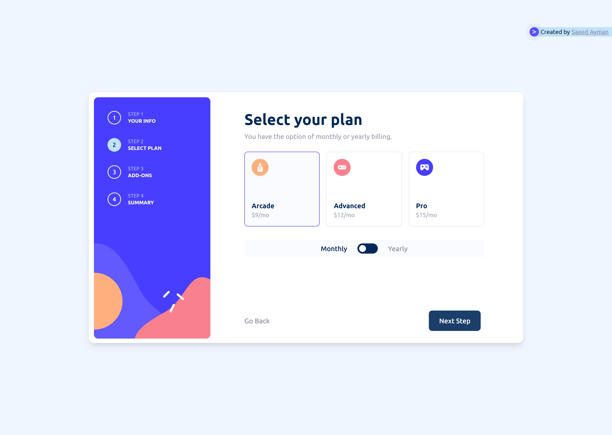

# Multi-step-form [Frontend Mentor]

## Table of contents

- [The challenge](#the-challenge)
- [Screenshot](#screenshot)
- [Objectives](#objectives)
- [Technologies](#technologies)
- [What I learned](#what-i-learned)
- [Links](#links)

## The challenge

Users should be able to:

- Complete each step of the sequence
- Go back to a previous step to update their selections
- See a summary of their selections on the final step and confirm their order
- View the optimal layout for the interface depending on their device's screen size
- See hover and focus states for all interactive elements on the page
- Receive form validation messages if:
  - A field has been missed
  - The email address phone number or name is not formatted correctly

## Screenshot

## Objectives

- My challenge is building the project without routing. To address this, I'm using Pinia Store to connect all app components across three stores
  - FormStore: Used for managing all steps of the form.
  - PlanStore: Manages user plans.
  - PersonalInfoStore: Stores user information (used during the login step).
- Ensure this design is responsive across all devices, while also enhancing its aesthetics and user-friendliness with smooth transitions.
- Incorporate validation using regular expressions to guide users by providing hints for correct input and indicating errors.

## Technologies

- Vue js
- Pinia Store
- Tailwind CSS

## What I learned

- Unlock advanced style and animation possibilities by linking `v-bind` with style and JavaScript within the HTML template.

- Enable server-side rendering (SSR) using `defineAsyncComponent` _(currently commented out)_, allowing for advanced context management to store and load component paths along with their content.

- Enable easy editing by utilizing context to add information, which is then easily reflected on the website, making the process simple and straightforward.

## Links

🔗 [Solution](https://github.com/Saeed-Ayman/multi-step-form)

🔗 [Live site](https://multi-step-form-peach-nine.vercel.app/)
